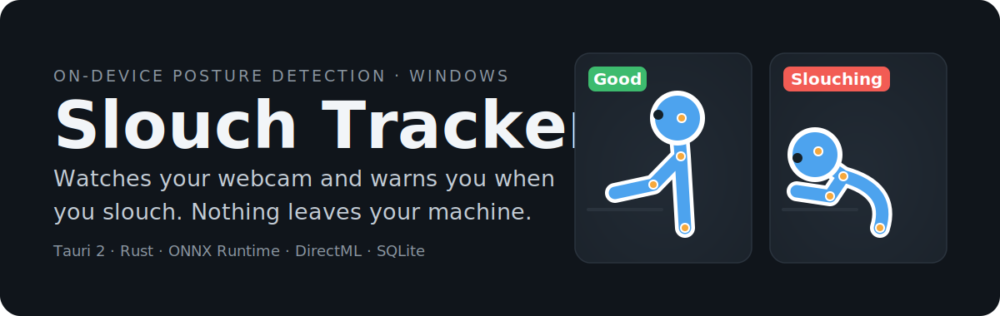
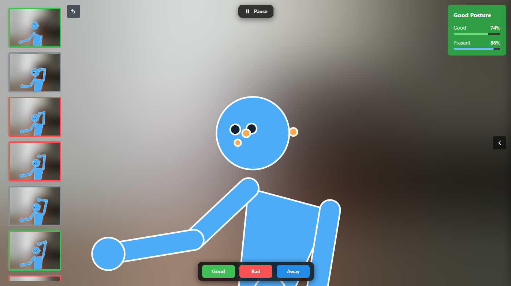
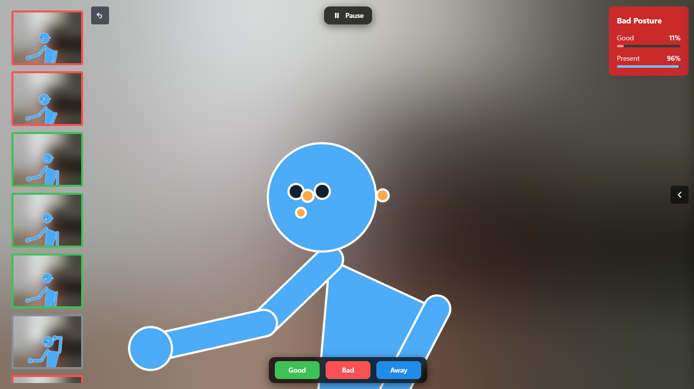
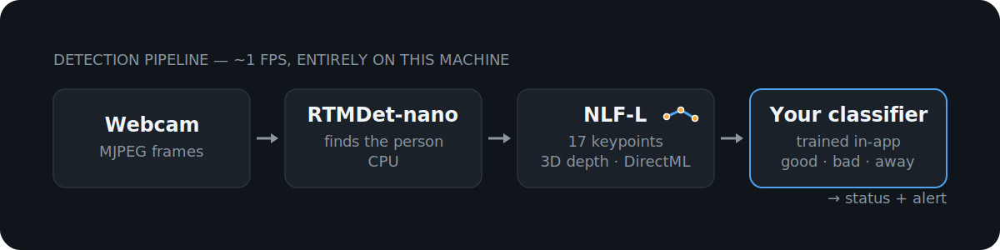

<p align="center">
  
</p>

<p align="center">
  <a href="https://github.com/SSS135/slouch_tracker/releases"></a>
  
  
  
  
  
</p>

**Slouch Tracker watches your webcam, estimates your body pose in real time, and warns you when you start slouching.** Everything — camera capture, ML inference, model training, and storage — runs locally in native Rust; there are no cloud services, no accounts, and no telemetry. The only network access the app ever makes is a one-time ~245 MB pose-model download on first launch (see [About the installer](#about-the-installer)); after that it runs fully offline.

## See it working

Privacy mode with the live skeleton avatar. Detection keeps running while the camera feed stays obscured:

| Good posture | Bad posture |
|---|---|
|  |  |

## How it works

<p align="center">
  
</p>

RTMDet-nano finds the person on the CPU; NLF-L then estimates 17 keypoints plus 3D depth on the GPU through the DirectML execution provider, both running on native ONNX Runtime (the Rust `ort` crate). A classifier you train in-app on your own labeled frames makes the final call: good, bad, or away. Detection runs at ~1 fps in every window mode; the preview renders at ~30 fps while the window is focused. Typical CPU usage is 1 to 2%.

Slouch Tracker is a Tauri 2 app: a Rust backend workspace (the `app` crate plus `slouch-domain`, `slouch-ml`, `slouch-vision`, `slouch-store`) with a deliberately thin Svelte 5 UI. The camera is owned natively (nokhwa, MJPEG) and previewed in the webview through a custom `slouchcam://` URI scheme; the frontend talks to Rust through generated [Specta](https://github.com/specta-rs/specta) bindings, with three raw-byte MessagePack commands reserved for bulk image data. See [specs.md](specs.md) for the full architecture.

## Features

- Train your own models: collect and label your own frames, then train a personalized classifier in-app — with optional k-fold cross-validation, reported metrics, and progress streamed live.
- Six classifier types (`mlp`, `knn`, `svm`, `kmeans_prototype`, `gaussian_nb`, `kmeans_logistic`), with parameter controls generated from the classifier registry.
- 12 selectable feature types (RTMDet features, NLF-L 3D-depth features, geometric and keypoint features), plus normalization (`z_score`/`layer`/`none`) and dimensionality reduction (`pca`/`random_projection`/`none`).
- Fast data collection: capture frames with the `G` (good), `B` (bad), and `A` (away) keys, or with the global hotkeys `Ctrl+Win+G` / `Ctrl+Win+B` / `Ctrl+Win+A`, which work while the app is unfocused.
- Local SQLite storage for frames, keypoints, feature vectors, thumbnails, settings, and trained models.
- Dataset export and import as portable `.slouchpack` archives via native file dialogs.
- Privacy mode: obscures the live preview while detection keeps running.
- Focus-aware power behavior: EcoQoS efficiency mode when the window is backgrounded, with detection continuing at the rates above.

## Installation

**System requirements:** Windows 10 or 11 (x64) with a DirectX 12-capable GPU. Inference runs through the DirectML execution provider; if no compatible GPU is present the app reports a clear error on startup rather than falling back silently.

**Camera placement:** for best detection quality, place the camera to the side of you, at eye level or slightly above. A side view makes slouching geometrically obvious to the pose model; strongly elevated or overhead angles weaken the depth-based posture cues.

1. Download the latest installer (`Slouch.Tracker_<version>_x64-setup.exe`) from the [GitHub Releases](https://github.com/SSS135/slouch_tracker/releases) page.
2. (Recommended) Verify the download against `SHA256SUMS.txt` on the same release:
   ```powershell
   Get-FileHash '.\Slouch.Tracker_1.0.0_x64-setup.exe' -Algorithm SHA256
   ```
   The printed hash must match the entry in `SHA256SUMS.txt`.
3. Run the installer and launch **Slouch Tracker**.

### "Windows protected your PC" (SmartScreen)

Release builds are unsigned (there is no code-signing certificate), so on first run Windows SmartScreen shows a blue "Windows protected your PC" dialog. This is expected. Click **More info**, then **Run anyway**. Because the build is unsigned, verifying the SHA-256 against `SHA256SUMS.txt` (step 2 above) is the recommended way to confirm you have the authentic installer.

### About the installer

- The installer is small. It bundles the person-detection model (RTMDet-nano, ~4 MB) and the native ONNX Runtime, but not the pose model. The first time you launch Slouch Tracker, it downloads the pose model (`nlf_l_crop_fp16.onnx`, ~245 MB) once from the project's [GitHub Releases](https://github.com/SSS135/slouch_tracker/releases), verifies it against a pinned SHA-256, and caches it in your app-data directory. This one-time download is the only network access the app ever makes; once it completes, all detection and training run fully offline. To prepare a machine that never touches the network, see [Fully offline installation](#fully-offline-installation) below.
- WebView2 runtime, at install time, on some systems: any system that already has the Microsoft WebView2 runtime (all of Windows 11 and virtually all of Windows 10) installs offline. On the rare stripped-down system without it, such as Windows 10 LTSC/IoT or a deliberately debloated install, the setup program downloads the small WebView2 runtime from Microsoft once. This is a Windows component fetched by the installer, separate from the pose-model download the app does on first launch.
- Per-user install: installs for the current user, so no administrator prompt is required.
- Your data survives uninstall. By default the uninstaller leaves your dataset, trained models, and settings on disk. Deleting them is opt-in: tick the *delete application data* checkbox in the uninstaller only if you want a full wipe.

### Fully offline installation

If a machine will never have internet access, place the pose model manually before first launch. The app detects it and never attempts the download:

1. On any connected machine, download the pose model from
   `https://github.com/SSS135/slouch_tracker/releases/download/models-v1/nlf_l_crop_fp16.onnx`.
2. Verify its SHA-256; the printed hash must equal
   `33bd300cd5a65681a5d671debd82a63f842c7420443cd9bb7424ca7aef82cca8`:
   ```powershell
   Get-FileHash '.\nlf_l_crop_fp16.onnx' -Algorithm SHA256
   ```
3. Copy the file into your app-data models folder (create the `models` folder if it does not exist):
   `%APPDATA%\com.slouchtracker.main\models\nlf_l_crop_fp16.onnx`.
   `%APPDATA%` expands to `C:\Users\<YourName>\AppData\Roaming`, so the full path is
   `C:\Users\<YourName>\AppData\Roaming\com.slouchtracker.main\models\nlf_l_crop_fp16.onnx`.
4. Install and launch **Slouch Tracker**. It checks this path before any network request:
   - If the file is present and the hash matches, the app starts normally and makes no network requests at all.
   - If the file is present but corrupt (hash mismatch), the app reports that the pose model is invalid and offers to re-download it; replace it with a correct copy to stay fully offline.

## Usage

The app is a single window: a live camera viewport with overlay controls, plus a slide-in panel with Settings, Collect, and Training tabs.

Capture keys (while the app is focused):

| Key | Action |
|-----|--------|
| `G` | Capture a *good posture* frame |
| `B` | Capture a *bad posture* frame |
| `A` | Capture an *away* frame |
| `C` | Clear sampled frames |
| `U` | Undo last dataset change |

Global hotkeys (work while the app is unfocused): `Ctrl+Win+G` / `Ctrl+Win+B` / `Ctrl+Win+A` capture good / bad / away with an audio confirmation beep.

Training workflow:

1. Collect labeled frames for *good*, *bad*, and *away* postures.
2. Open the Training tab, pick features, classifier, normalization, and reduction, and press **Train**.
3. Review the cross-validation metrics. The trained model is deployed automatically for live detection.

The app tracks whether the model needs retraining as you add data, so you can keep refining it as your dataset grows.

## Privacy

- Everything runs locally: detection, feature extraction, and training are native Rust on your own machine, with no telemetry. The only network use, ever, is the one-time pose-model download on first launch (see [About the installer](#about-the-installer)), and even that is avoidable by pre-placing the model (see [Fully offline installation](#fully-offline-installation)).
- Your data stays on disk: frames, keypoints, feature vectors, thumbnails, settings, and trained models live in a local SQLite database under your user app-data directory.
- Privacy mode obscures the live preview (blurred) while detection continues, so you can keep tracking without a visible camera feed on screen.
- Datasets leave the machine only when you export a `.slouchpack` file through a native save dialog.

## Build from source

### Prerequisites

- **Windows 10/11 (x64)**
- **Git LFS**, required. The RTMDet detection model (`rtmdet-nano.onnx`, ~4 MB) and the app icons are stored via Git LFS; cloning without Git LFS installed produces pointer files instead of the real assets, and the build will be broken. The larger NLF-L pose model (~245 MB) is not in the repository. Dev builds obtain it the same way end users do (first-run download), or you can place it manually; see the note under *Steps*.
- **Rust 1.88+** (with the `x86_64-pc-windows-msvc` toolchain)
- **Node.js 20+**
- **Visual Studio 2022** with the *Desktop development with C++* workload (any edition; Community works)
- **WebView2 runtime** (preinstalled on Windows 11; on Windows 10 install the Evergreen runtime from Microsoft)

### Steps

```bash
# 1. Install Git LFS once per machine
git lfs install

# 2. Clone (LFS assets are fetched automatically)
git clone https://github.com/SSS135/slouch_tracker.git
cd slouch_tracker

# 3. Install frontend dependencies
npm install

# 4a. Run in development
npm run tauri:dev

# 4b. Or build the Windows NSIS installer
npm run tauri:build:win
```

> Cargo must run inside a Visual Studio 2022 x64 developer environment (vcvars64). `npm run tauri:*` handles this when launched from a developer shell; for raw `cargo` commands, first run:
> `call "C:\Program Files\Microsoft Visual Studio\2022\Community\VC\Auxiliary\Build\vcvars64.bat"`.

> Pose model for dev builds: development and release builds do not bundle the NLF-L pose model. On first launch the app downloads it automatically, or you can pre-place `nlf_l_crop_fp16.onnx` (SHA-256 `33bd300cd5a65681a5d671debd82a63f842c7420443cd9bb7424ca7aef82cca8`) at either `src-tauri\resources\models\nlf_l_crop_fp16.onnx` or the app-data path `%APPDATA%\com.slouchtracker.main\models\nlf_l_crop_fp16.onnx`. See [Fully offline installation](#fully-offline-installation).

## Development

```bash
# Frontend tests (Vitest)
npm run test:svelte
npm run test:svelte -- <pattern>      # single file / pattern

# Type checking and linting
npm run check:svelte
npm run check:svelte:plumbing
npm run lint:svelte

# Rust tests (must run inside a VS 2022 x64 dev environment / vcvars64)
node scripts/run-gate.mjs             # wraps fmt / clippy / test with vcvars64
# or directly:
call "C:\Program Files\Microsoft Visual Studio\2022\Community\VC\Auxiliary\Build\vcvars64.bat" && cargo test --manifest-path src-tauri/Cargo.toml --workspace

# End-to-end
npm run test:e2e:web                  # Playwright against the mock-Tauri browser harness
npm run tauri:build:dev:win && npm run test:e2e:native   # WebdriverIO against the devbuild binary
```

After changing any Rust command signature, DTO, or event, regenerate and verify the TypeScript bindings:

```bash
npm run bindings:generate
npm run bindings:check
```

## License

Slouch Tracker is released under the [MIT License](LICENSE).

> Binary licensing note: the MIT license covers the source code. The installer bundles only MIT and Apache-2.0 components, including the Apache-2.0 RTMDet detector. The NLF-L pose model is downloaded on first launch from the project's Releases, hosted with the permission of its author, István Sárándi. Because the pose-model weights are non-commercial, **the Slouch Tracker application is for non-commercial scientific research, non-commercial education, or non-commercial artistic use cases only.**

Third-party components and their licenses are listed in [THIRD-PARTY-NOTICES.md](THIRD-PARTY-NOTICES.md).

### Acknowledgments

- [OpenMMLab](https://github.com/open-mmlab): RTMDet person-detection model.
- [NLF (Neural Localizer Fields)](https://github.com/isarandi/nlf): NLF-L 3D human-pose model (weights are for non-commercial research use only).
- [Microsoft ONNX Runtime](https://github.com/microsoft/onnxruntime): native inference runtime.
- [Tauri](https://tauri.app): the desktop application framework.
